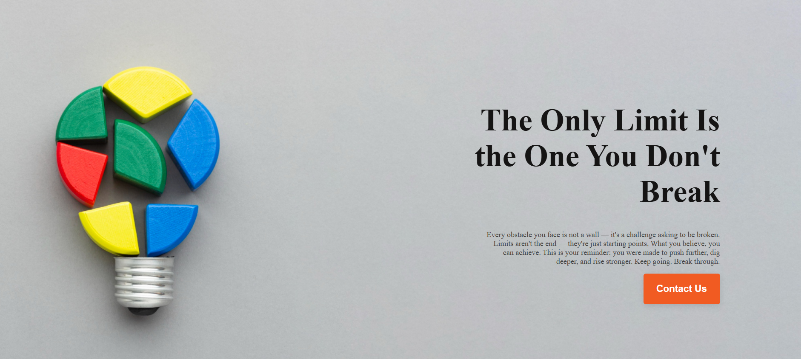
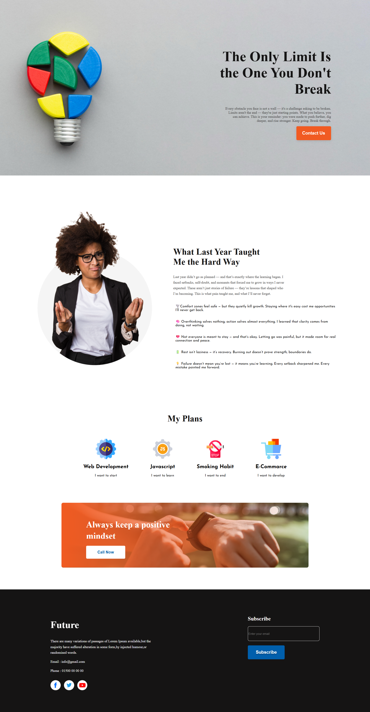

# 💡 Own The Day — Self Motivation Landing Page

[🔗 Live Demo](https://devo-ab.github.io/own-the-day/)

**Own The Day** is a fully responsive self-motivation landing page designed using pure **HTML and CSS**. It shares a personal story of past failures, new plans, and the importance of maintaining a positive mindset — aiming to inspire and uplift others through clean visuals and powerful content.

---

## ✨ Features

- ✅ Fully responsive for all devices
- ✅ Banner section with motivational message
- ✅ Personal story about past failures
- ✅ Actionable plans for the future
- ✅ Positive mindset highlight
- ✅ Clean and minimalistic layout
- ✅ Semantic HTML and modern CSS practices

---

## 🛠️ Tech Stack

| Technology | Role                     |
|------------|--------------------------|
| HTML5      | Structure & content       |
| CSS3       | Styling & responsiveness |

---

## 📁 Folder Structure

```
won-the-day/
├── assets/
│   ├── banner/             # Banner images or hero section
│   ├── icons/              # Icon assets
│   ├── images/             # General images used in the webpage
│   ├── logo/               # Logo files
├── css/                    # Stylesheets (style.css)
├── preview/                # Screenshots for README
├── index.html              # Main landing page
└── README.md               # Project documentation
```

## 📸 Screenshots

### 🖼️ Banner Section



### 🖼️ Last Year


### 🖼️ Full Preview


---

## 🚀 Run Locally

To run this project on your machine:

```bash
git clone https://github.com/devo-ab/own-the-day.git
cd own-the-day
 ```

🌐 Deployment
This project is deployed using GitHub Pages.

Deploy in 3 steps:
Push the project to GitHub

Go to Settings > Pages

Select branch: main and folder: / (root) — then click Save

# 👤 Author

# Avi Jit

## :mailbox: Reach me out

<p align="left">
<a href="https://linkedin.com/in/itsavijitb" target="blank"></a>
<a href="https://twitter.com/itsavijitb" target="blank"></a>
<a href="https://facebook.com/itsavijitb" target="blank"></a>
<a href="https://instagram.com/itsavijitb" target="blank"></a>
</p>